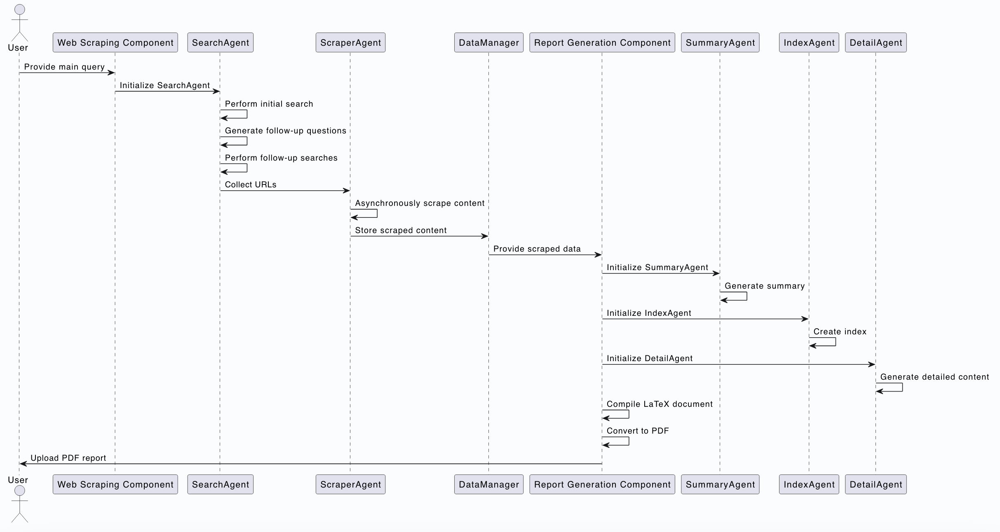

# Research-Analysist

Welcome to the Research-Analysist project! This project is designed to automate the process of web scraping and report generation, providing comprehensive research reports based on user-defined topics.

## Table of Contents

- [Overview](#overview)
- [Architecture](#architecture)
- [Features](#features)
- [Installation](#installation)
- [Usage](#usage)
- [Detailed Workflow](#detailed-workflow)
- [Agents and Their Roles](#agents-and-their-roles)
- [Tasks and Their Execution](#tasks-and-their-execution)
- [To-Do List](#to-do-list)
- [Contributing](#contributing)
- [License](#license)
- [Contact](#contact)

## Overview

The Research-Analysist project is divided into two main components:
1. **Web Scraping and Data Collection**: Gathers data from the web based on user-defined topics.
2. **Report Generation**: Generates comprehensive research reports based on the collected data.

## Architecture



### Web Scraping and Data Collection

- **Agents**: Handle specific tasks such as searching the web, scraping content, and generating follow-up questions.
- **Data Manager**: Manages the collected data, ensuring it is stored, processed, and saved correctly.
- **Main Script**: Orchestrates the agents and manages the workflow.

### Report Generation

- **Agents**: Handle tasks such as generating an index of topics, creating summaries, and writing detailed content.
- **Tasks**: Specific tasks assigned to agents to perform their roles.
- **Main Script**: Orchestrates the agents and tasks, managing the workflow.

## Features

- **Automated Web Scraping**: Collects data from the web based on user-defined topics.
- **Intelligent Agents**: Uses language models to perform context-aware processing.
- **Comprehensive Reports**: Generates detailed research reports with summaries, indexes, and in-depth content.
- **Asynchronous Processing**: Efficiently handles web scraping tasks.
- **Microservices Architecture**: Components can be run independently or as microservices.

## Installation

### Prerequisites

- Python 3.8 or higher
- [pip](https://pip.pypa.io/en/stable/)

### Steps

1. **Clone the Repository**:
   ```sh
   git clone https://github.com/ShivamB25/Research-Analysist
   cd Research-Analysist
   ```

2. **Install Dependencies**:
   ```sh
   pip install -r requirements.txt
   ```

3. **Set Up Environment Variables**:
   - Copy the `.env.example` file to `.env` and fill in the required values.

## Usage

### Web Scraping and Data Collection

1. **Configure the Main Query**:
   - Open `web/main.py` and set the `main_query` variable to your topic of interest.
   ```python
   main_query = "decentralized GPU network"  # Replace with your topic
   ```

2. **Run the Script**:
   ```sh
   python web/main.py
   ```

### Report Generation

1. **Ensure Scraped Data is Available**:
   - Make sure `scraped_data.json` is generated by the web scraping component.

2. **Run the Report Generation Script**:
   ```sh
   python data_to_report/main.py
   ```

## Detailed Workflow

### Web Scraping and Data Collection

| Step                | Description                                                                 |
|---------------------|-----------------------------------------------------------------------------|
| **Initialization**  | Load environment variables and initialize agents. Users input their research topic in the `main_query` variable. |
| **Main Query**      | Perform an initial search using the `SearchAgent`. Retrieve top search results and extract URLs. |
| **Follow-Up Questions** | Generate 10 follow-up questions based on the main query. Perform searches for each follow-up question and retrieve top results. |
| **Scraping Content** | Asynchronously scrape content from the collected URLs using the `ScraperAgent`. Store the scraped content in `scraped_data.json`. |
| **Data Management** | Manage the scraped content using the `DataManager`. |

### Report Generation

| Step                | Description                                                                 |
|---------------------|-----------------------------------------------------------------------------|
| **Initialization**  | Load environment variables and initialize agents and tasks.                 |
| **Reading Scraped Data** | Load the scraped data from `scraped_data.json`.                          |
| **Generating Summary** | Generate a brief summary of the research data using the `SummaryAgent`.    |
| **Generating Index** | Generate a structured index of topics and subtopics using the `IndexAgent`. |
| **Generating Detailed Content** | Generate detailed content for each main topic and subtopic using the `DetailAgent`. |
| **Creating LaTeX Document** | Compile the generated content into a LaTeX document.                   |
| **Generating PDF Report** | Convert the LaTeX document into a PDF report and upload it to an online platform. |

## Agents and Their Roles

### Web Scraping and Data Collection Agents

| Agent                 | Role                                                                 |
|-----------------------|----------------------------------------------------------------------|
| **SearchAgent**       | Performs web searches and generates follow-up questions. Uses the `EnhancedSerperDevTool` for performing searches. |
| **ScraperAgent**      | Extracts content from web pages asynchronously. Uses the `WebScraper` tool for scraping content. |
| **ContextGeneratorAgent** | Synthesizes information from multiple sources and generates insightful analysis (Not actively used in the current implementation). |

### Report Generation Agents

| Agent                 | Role                                                                 |
|-----------------------|----------------------------------------------------------------------|
| **IndexAgent**        | Generates a structured index of topics and subtopics.                |
| **SummaryAgent**      | Creates brief summaries for main topics.                             |
| **DetailAgent**       | Produces in-depth content for subtopics.                             |

## Tasks and Their Execution

### Web Scraping and Data Collection Tasks

| Task                  | Description                                                                 |
|-----------------------|-----------------------------------------------------------------------------|
| **InitialSearchTask** | Performs an internet search for the main query and collects the top 5 results. |
| **FollowUpSearchTask** | Performs an internet search for a follow-up question and collects the top 5 results. |
| **ScrapingTasks**     | Scrapes content from the given URLs and returns the text.                    |

### Report Generation Tasks

| Task                  | Description                                                                 |
|-----------------------|-----------------------------------------------------------------------------|
| **ContextTask**       | Generates a structured index of main topics and subtopics based on the research data. |
| **SummaryTask**       | Generates a brief and concise summary for the main topic, including the subtopics. |
| **DetailTask**        | Produces detailed content for a subtopic on the main topic.                 |

## To-Do List

### Enhancements and Features

| Task                    | Description                                                                 |
|-------------------------|-----------------------------------------------------------------------------|
| **Make the Code More Modular** | Refactor the existing code to improve modularity and separation of concerns. Break down large functions into smaller, reusable functions. Organize code into more granular modules and packages. |
| **Add API Support**     | Develop a RESTful API to interact with the web scraping and report generation components. Implement endpoints for initiating web scraping, checking the status, and retrieving results. Use frameworks like Flask or FastAPI for the API implementation. |
| **Add Email Server Support** | Integrate an email server to send the generated PDF reports automatically. Configure SMTP settings and create email templates. Implement functionality to send emails with attachments. |
| **Write Tests**         | Develop unit tests for all key components and functions. Use testing frameworks like `unittest` or `pytest`. Ensure high test coverage and include tests for edge cases. |
| **Improve Error Handling** | Enhance error handling mechanisms to provide more informative error messages. Implement retry logic for network-related operations. Log errors and exceptions for easier debugging and monitoring. |
| **Add Logging**         | Integrate a logging framework to capture logs at various levels (info, debug, error). Configure log files and log rotation. Include logging in key parts of the code to track the flow and identify issues. |
| **Optimize Performance** | Analyze the performance of the web scraping and report generation components. Optimize the code to reduce execution time and resource usage. Implement caching mechanisms where appropriate. |
| **Enhance Documentation** | Expand the README.md with more detailed usage instructions and examples. Create additional documentation for developers, including code comments and docstrings. Provide a comprehensive guide for setting up and running the project. |
| **Add Configuration Management** | Use configuration management tools to manage environment variables and settings. Implement support for different environments (development, testing, production). Use tools like `configparser` or `pydantic` for managing configurations. |
| **Add User Authentication** | Implement user authentication for the API. Use OAuth2 or JWT for secure authentication. Manage user roles and permissions. |

### Already Done

| Task                    | Description                                                                 |
|-------------------------|-----------------------------------------------------------------------------|
| **Web Scraping and Data Collection** | Implemented `SearchAgent` to perform web searches. Implemented `ScraperAgent` to scrape content from web pages asynchronously. Generated follow-up questions based on the main query. Stored scraped content in `scraped_data.json`. |
| **Report Generation**   | Implemented `IndexAgent` to generate a structured index of topics and subtopics. Implemented `SummaryAgent` to create brief summaries for main topics. Implemented `DetailAgent` to produce in-depth content for subtopics. Compiled generated content into a LaTeX document. Converted LaTeX document into a PDF report. Uploaded PDF report to an online platform for sharing and collaboration. |
| **Environment Setup**   | Loaded environment variables using `dotenv`. Configured the system based on values defined in the `.env` file. |
| **Agents and Tasks Initialization** | Initialized agents and tasks for both web scraping and report generation components. |
| **Data Management**     | Managed scraped content using the `DataManager`. Ensured data is stored correctly and saved in `scraped_data.json`. |
| **Basic Error Handling** | Implemented basic error handling for network-related operations. Provided informative error messages for common issues. |

## Contributing

We welcome contributions! Please follow these steps:

1. Fork the repository.
2. Create a new branch (`git checkout -b feature-branch`).
3. Make your changes and commit them (`git commit -m 'Add new feature'`).
4. Push to the branch (`git push origin feature-branch`).
5. Create a pull request.

## License

This project is licensed under the MIT License. See the [LICENSE.md](LICENSE.md) file for details.

## Contact

For any questions or feedback, please reach out to [Shiambansal.in30@gmail.com](mailto:Shiambansal.in30@gmail.com).

